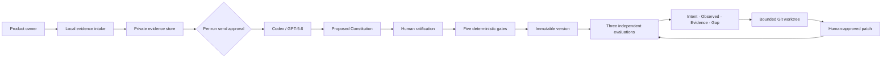

# CriteriaForge

> Human intent becomes a ratified, executable Product Constitution; Codex may apply it, but may never silently redefine it.

CriteriaForge is a local-first product for non-technical product owners who build with Codex. It turns original product evidence into a human-ratified, testable Product Constitution, evaluates a fixed artifact three times against the same contract, and lets Codex repair only an explicitly approved gap inside a disposable Git worktree.

This repository is an OpenAI Build Week project in the **Work & Productivity** category. It is licensed under the [MIT License](LICENSE).

## What is working

- A seven-stage English/Japanese interface built with Next.js and shadcn/ui.
- A public, sign-in-free FounderBrief replay backed by three recorded `gpt-5.6-sol` evaluations, with model, Codex version, hashes, run count, citation verification, and source commit shown in the interface.
- A macOS local runtime bound only to a random `127.0.0.1` port, protected by a one-time bootstrap exchange, an HttpOnly session cookie, CSRF proof, origin checks, and a restrictive Content Security Policy.
- Private SQLite and content-addressed file storage under `~/Library/Application Support/CriteriaForge/`, with `0700` directories, `0600` files, restart recovery, and complete workspace deletion.
- Local normalization for PDF, DOCX, PPTX, TXT, Markdown, CSV, XLSX, PNG, JPEG, WebP, SVG, MP4, MOV, WebM, and local Git repositories. Unsupported or unreadable portions remain explicit instead of being guessed.
- ChatGPT OAuth reuse through `codex login status` and `codex exec`. CriteriaForge never reads `~/.codex/auth.json` or asks for an API key.
- Strict JSON Schema validation, one structural repair retry, local citation/hash verification, five compile safeguards, immutable Constitution rows, four-layer absolute evaluation, and three-run stability checks.
- A live local journey from source intake through eight-section drafting, human decisions, three-run calibration, immutable compilation, Git target freezing, and three-run formal evaluation. Every Codex send has a fresh segment-level disclosure review.
- Bounded remediation through a detached Git worktree, a read-only Constitution copy, exact file allowlists, forbidden paths, approved command arrays, patch verification, human approval, and original-HEAD rechecking.
- Local remediation and re-evaluation screens that refuse unstable findings, expose the full verified patch only on the Mac, and compare results only when the Constitution, model, reasoning effort, prompt version, and Schema version match.
- Explicit export of a shareable `.criteriaforge` package with schemas, calibration cases, acceptance cases, a Codex Skill, an `AGENTS.md` fragment, and SHA-256 checksums. Private citations and known secret/path markers are rejected.

## Public demo

The browser demo uses fictional FounderBrief data. It does not upload files or call Codex. The banner says **“Replay recorded GPT-5.6 evaluation”** and exposes the reproducibility record. The recorded result was produced by three real `gpt-5.6-sol` runs with the same input and settings; it is not represented as a live run.

Open the production demo: [criteriaforge.vercel.app](https://criteriaforge.vercel.app)

```bash
cd apps/web
npm ci
npm run build:demo
npm run start
```

The demo build physically removes local API routes before compilation and verifies that the output contains no local API bundle, `better-sqlite3`, child-process marker, or local session secret name.

## Local macOS edition

Requirements:

- macOS 14 or later
- Node.js 24 (see `.nvmrc`)
- npm
- Git
- Codex CLI authenticated with `codex login`

```bash
cd apps/web
npm ci
npm run local
```

`npm run local` chooses an unused loopback port, starts CriteriaForge, and opens the one-time bootstrap URL. Originals, normalized evidence, frames, run records, and worktrees stay outside the repository.

For a production-optimized local verification build, use `npm run build:local` before `CRITERIAFORGE_LOCAL_PRODUCTION=1 npm run local`. A normal `npm run build` follows the selected deployment environment and must not be reused to infer the local/public mode.

The local interface connects all seven stages to persisted production state. The first five stages have also completed a live `gpt-5.6-terra` self-test: a source-derived draft, human ratification, three stable calibration runs, an immutable v1.0, a 314-segment Git snapshot, and three formal evaluations. Those formal runs disagreed on evidence sufficiency, so the product correctly returned `blocked` and disabled automated repair instead of hiding the disagreement.

The bounded worktree engine and its local repair/re-evaluation screens are implemented and covered by automated tests, but a clean-repository end-to-end Codex repair has not yet been recorded for the submission. Browser-side video-frame extraction and approved Web-observation capture also remain incomplete; neither is claimed as release-complete.

## Validation

```bash
make preflight
make web-check
make demo-check
make video-check

cd apps/web
npm run test:e2e
npm audit --audit-level=high
npm run license:check
```

The current automated suite contains 65 unit/integration checks and four public desktop/mobile browser runs. It covers the data contracts, five compile safeguards, immutable storage and migration, semantic invalidation, four-layer aggregation, evidence parsing and malicious inputs, OAuth/Codex structured output behavior, citation verification, private export, bounded Git remediation, desktop/mobile navigation, keyboard use, console errors, and critical/serious accessibility violations. Separate opt-in local browser checks exercise intake, restart recovery, three-run calibration/compilation, and three-run formal evaluation with an authenticated Codex CLI.

The sub-three-minute demo film has versioned [Remotion source](video/criteriaforge/README.md). It uses the creator-approved final English narration, burned-in captions, and actual public/local CriteriaForge screens; all motion and scene timing are frame-driven. Captures, narration, and rendered media remain in the ignored local output area, so a clean clone needs those reviewed inputs before rendering.

## Architecture



The source language is authoritative. Translations are reference-only. A failed must-pass rule is never offset by quality elsewhere. Unstable evaluation, missing evidence, conflicting authority, and unknown applicability all stop the decision.

Detailed design and evidence:

- [Architecture](docs/architecture.md)
- [Security and privacy](docs/security-privacy.md)
- [Evaluation record](docs/evaluation-plan.md)
- [Decision log](docs/decision-log.md)
- [Build log](docs/build-log.md)
- [Judging evidence](submission/judging-evidence.md)

## Known limits

- This first release is for one person on one Mac.
- Private evidence is protected by macOS account permissions and FileVault; CriteriaForge does not add its own at-rest encryption.
- Video vision is supported by the data model, but the current server ingestion leaves frame extraction pending for the browser. Audio without supplied subtitles is never inferred.
- Web evaluation accepts only localhost or an explicitly approved URL by design; the recorded demo does not perform live Web observation.
- A dirty Git snapshot can be evaluated, but this release refuses to start bounded repair until the repository is clean; it will not pretend a detached worktree contains uncommitted source changes.
- `.fig` files are not parsed. Export PDF, PNG, or SVG from Figma.
- The public demo is a recorded replay, not a live GPT‑5.6 endpoint.
- AI determinism is not promised. CriteriaForge promises to detect material disagreement and stop.

## Submission status

CriteriaForge was submitted to OpenAI Build Week on July 21, 2026 JST. The [public GitHub repository](https://github.com/hapx2yuki/Global-Build-Week6), [v0.1.0 source release](https://github.com/hapx2yuki/Global-Build-Week6/releases/tag/v0.1.0), [sign-in-free Vercel demo](https://criteriaforge.vercel.app), [2:38 public YouTube demo](https://youtu.be/Y1xxjB92r7Q), and [Devpost project](https://devpost.com/software/global-build-week-6) are live. The video title and public watch page were checked from a separate unauthenticated retrieval environment; the demo and Devpost pages returned HTTP 200 without account credentials. The required Codex `/feedback` Session ID was supplied in the private submission field, and `make submission-check` passes with the local submission metadata.
