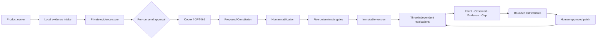

# CriteriaForge

> Human intent becomes a ratified, executable Product Constitution; Codex may apply it, but may never silently redefine it.

CriteriaForge is a local-first product for non-technical product owners who build with Codex. It turns original product evidence into a human-ratified, testable Product Constitution, evaluates a fixed artifact three times against the same contract, and lets Codex repair only an explicitly approved gap inside a disposable Git worktree.

This repository is an OpenAI Build Week project in the **Work & Productivity** category. It is licensed under the [MIT License](LICENSE).

## What is working

- A seven-stage English/Japanese interface built with Next.js and shadcn/ui.
- A public, sign-in-free FounderBrief replay backed by three recorded `gpt-5.6-sol` evaluations, with model, Codex version, hashes, run count, citation verification, and source commit shown in the interface.
- A macOS local runtime bound only to a random `127.0.0.1` port, protected by a one-time bootstrap exchange, an HttpOnly session cookie, CSRF proof, origin checks, and a restrictive Content Security Policy.
- Private SQLite and content-addressed file storage under `~/Library/Application Support/CriteriaForge/`, with `0700` directories, `0600` files, restart recovery, and complete workspace deletion.
- Local normalization for PDF, DOCX, PPTX, TXT, Markdown, CSV, XLSX, PNG, JPEG, WebP, SVG, MP4, MOV, WebM, and local Git repositories. Unsupported or unreadable portions remain explicit instead of being guessed.
- ChatGPT OAuth reuse through `codex login status` and `codex exec`. CriteriaForge never reads `~/.codex/auth.json` or asks for an API key.
- Strict JSON Schema validation, one structural repair retry, local citation/hash verification, five compile safeguards, immutable Constitution rows, four-layer absolute evaluation, and three-run stability checks.
- Bounded remediation through a detached Git worktree, a read-only Constitution copy, exact file allowlists, forbidden paths, approved command arrays, patch verification, human approval, and original-HEAD rechecking.
- Explicit export of a shareable `.criteriaforge` package with schemas, calibration cases, acceptance cases, a Codex Skill, an `AGENTS.md` fragment, and SHA-256 checksums. Private citations and known secret/path markers are rejected.

## Public demo

The browser demo uses fictional FounderBrief data. It does not upload files or call Codex. The banner says **“Replay recorded GPT-5.6 evaluation”** and exposes the reproducibility record. The recorded result was produced by three real `gpt-5.6-sol` runs with the same input and settings; it is not represented as a live run.

```bash
cd apps/web
npm ci
npm run build:demo
npm run start
```

The demo build physically removes local API routes before compilation and verifies that the output contains no local API bundle, `better-sqlite3`, child-process marker, or local session secret name.

## Local macOS edition

Requirements:

- macOS 14 or later
- Node.js 20 (see `.nvmrc`)
- npm
- Git
- Codex CLI authenticated with `codex login`

```bash
cd apps/web
npm ci
npm run local
```

`npm run local` chooses an unused loopback port, starts CriteriaForge, and opens the one-time bootstrap URL. Originals, normalized evidence, frames, run records, and worktrees stay outside the repository.

The local interface currently connects workspace creation and file ingestion directly to the private runtime. The production API also implements draft generation, human decisions, immutable compilation, Git target snapshots, three-run evaluation, remediation, patch application, and Constitution export. The remaining release work is to connect every advanced local API state to the seven interface stages and complete browser-side video-frame and approved-Web-observation capture; these are not claimed as complete in the submission materials.

## Validation

```bash
make preflight
make web-check
make demo-check

cd apps/web
npm run test:e2e
npm audit --audit-level=high
```

The current automated suite covers the data contracts, five compile safeguards, immutable storage, semantic invalidation, four-layer aggregation, evidence parsing and malicious inputs, OAuth/Codex structured output behavior, citation verification, private export, bounded Git remediation, desktop/mobile navigation, keyboard use, console errors, and critical/serious accessibility violations.

## Architecture



The source language is authoritative. Translations are reference-only. A failed must-pass rule is never offset by quality elsewhere. Unstable evaluation, missing evidence, conflicting authority, and unknown applicability all stop the decision.

Detailed design and evidence:

- [Architecture](docs/architecture.md)
- [Security and privacy](docs/security-privacy.md)
- [Evaluation record](docs/evaluation-plan.md)
- [Decision log](docs/decision-log.md)
- [Build log](docs/build-log.md)
- [Judging evidence](submission/judging-evidence.md)

## Known limits

- This first release is for one person on one Mac.
- Private evidence is protected by macOS account permissions and FileVault; CriteriaForge does not add its own at-rest encryption.
- Video vision is supported by the data model, but the current server ingestion leaves frame extraction pending for the browser. Audio without supplied subtitles is never inferred.
- Web evaluation accepts only localhost or an explicitly approved URL by design; the recorded demo does not perform live Web observation.
- `.fig` files are not parsed. Export PDF, PNG, or SVG from Figma.
- The public demo is a recorded replay, not a live GPT‑5.6 endpoint.
- AI determinism is not promised. CriteriaForge promises to detect material disagreement and stop.

## Submission status

Implementation and verification are in progress. A public GitHub URL, deployed Vercel URL, public sub-three-minute YouTube video, Codex `/feedback` Session ID, and final Devpost submission are recorded only after each exists and has been checked while logged out. `make submission-check` intentionally fails until those external deliverables are complete.
