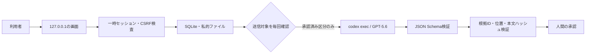

# 構成設計

## 実行形態

同じ画面を、用途の異なる二つの実行方式で使う。

| 項目 | macOSローカル版 | 公開体験版 |
| --- | --- | --- |
| データ | 利用者の実データ | 架空のFounderBriefのみ |
| 保存 | SQLiteと端末内ファイル | ブラウザの再生回数だけ |
| AI | `codex exec`からGPT‑5.6を呼ぶ | 実測済み3回分を再生 |
| 認証 | 既存の`codex login` | 不要 |
| API | `/api/v1`を有効化 | 配備用ビルドから物理的に除外 |
| 待受 | ランダムな`127.0.0.1`ポート | Vercel |

公開版は`npm run build:demo`で`src/app/api`を一時的に構築対象外へ移し、構築後に元へ戻す。続く検査で、公開成果物にAPI経路、`better-sqlite3`、子プロセス識別子、ローカル認証用変数名がないことを確認する。

## 信頼境界



- OAuthの認証ファイルとトークン本文は読まない。
- 原本と抽出本文は`~/Library/Application Support/CriteriaForge/`だけに置く。
- 外部送信は、目的・モデル・区分・文字量を利用者が実行ごとに承認する。
- AI出力は構造検査と端末内根拠検査の両方を通った場合だけ保存する。
- 監査記録には本文を入れず、識別子、ハッシュ、状態だけを記録する。

## 中核処理

1. 形式別処理器が原本を位置情報付きの区分へ変換する。
2. GPT‑5.6が8区分の憲法案、重要質問、矛盾候補を構造化出力する。
3. 人間が承認、拒否、保留、直接編集を行う。
4. 純粋関数が`Intent complete`、`Ratified`、`Evaluable`、`Consistent`、`Stable`を判定する。
5. 全条件を満たす場合だけ、SQLiteの更新禁止トリガーを持つ不可逆版を保存する。
6. 同一の憲法、対象、モデル、Codex版、指示版、Schema版で3回評価する。
7. 引用を端末内で再検証し、四層評価へ集約する。不一致は多数決で隠さない。
8. 修正は一時worktreeで行い、許可外変更、憲法変更、試験失敗、元HEAD変更を拒否する。

## 保存

```text
~/Library/Application Support/CriteriaForge/
├── database.sqlite
├── workspaces/<workspace-id>/
│   ├── blobs/
│   ├── normalized/
│   ├── frames/
│   ├── runs/
│   └── worktrees/
├── backups/
└── logs/
```

SQLiteはWAL、外部キー制約、同期書込みを有効にする。ディレクトリは`0700`、ファイルは`0600`。憲法版は更新禁止トリガーで保護する。案件削除は関連行と案件ディレクトリを一つの操作で削除する。SSDの物理完全消去は保証せず、FileVaultを推奨する。

## 失敗と復旧

- 強制終了時の実行中処理は、再起動時に`interrupted`へ移す。
- 構造違反は同じ入力で一度だけ修復し、二度失敗した出力は採用しない。
- 根拠検証に失敗した引用は削除し、必要数を下回る結論を`undetermined`へ戻す。
- モデルを無断で切り替えない。
- 元Gitがdirty、またはHEAD変更の場合、自動適用せずパッチを残す。
- 公開版ではAI、アップロード、SQLiteの全経路を配備成果物から除く。

## 現在残る実装課題

- ローカル画面の後半6段階を、実装済みAPIの全状態へ接続する。
- 動画フレームをブラウザ内で抽出し、最大120枚の位置情報付き根拠として保存する。
- Playwrightによる承認済みWeb手順の取得画面を接続する。
- 新しいmacOS利用者環境での導入再現試験を行う。
